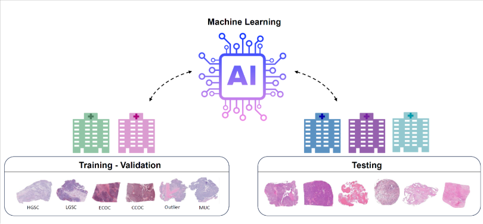

# Fine-grained Visual Classification: Ovarian-Cancer-Subtype-Classification

The goal of the UBC Ovarian Cancer subtypE clAssification and outlier detectioN (UBC-OCEAN) is to classify ovarian cancer subtypes. I will build a model trained on the world's most extensive ovarian cancer dataset of histopathology images obtained from more than 20 medical centers.

# Description

Ovarian carcinoma is the most lethal cancer of the female reproductive system. There are five common subtypes of ovarian cancer: high-grade serous carcinoma, clear-cell ovarian carcinoma, endometrioid, low-grade serous, and mucinous carcinoma. Additionally, there are several rare subtypes ("Outliers"). These are all characterized by distinct cellular morphologies, etiologies, molecular and genetic profiles, and clinical attributes. Subtype-specific treatment approaches are gaining prominence, though first requires subtype identification, a process that could be improved with data science.

Currently, ovarian cancer diagnosis relies on pathologists to assess subtypes. However, this presents several challenges, including disagreements between observers and the reproducibility of diagnostics. Furthermore, underserved communities often lack access to specialist pathologists, and even well-developed communities face a shortage of pathologists with expertise in gynecologic malignancies.

Deep learning models have exhibited remarkable proficiency in analyzing histopathology images. Yet challenges still exist, such as the need for a significant amount of training data, ideally from a single source. Technical, ethical, and financial constraints, as well as confidentiality concerns, make training a challenge. In this competition, you will have access to the most extensive and diverse ovarian cancer dataset of histopathology images from more than 20 centers across four continents.

My work could yield improved accuracy in identifying ovarian cancer subtypes. Better classification would enable clinicians to formulate personalized treatment strategies regardless of geographic location. This targeted approach has the potential to enhance treatment efficacy, reduce adverse effects, and ultimately contribute to better patient outcomes for those diagnosed with this deadly cancer.

# Summary

## EDA
**Giant image dataset**. There are 538 image samples in the training set. But each image has a giant resolution ratio. The average size of each image is more than 1 GB, the whole training set is 780 GB. Currently, I resized them to 2048 * 2048 and 512 * 512 to get the baseline result.

**K-Fold**. This project doesn't provide the test set. Therefore I implemented the k-fold on the training set to create the validation set.

## Versions and results

| Version | Description | validation accuracy |
| --      |  --         |   --                |
|  0      | baseline    |   0.42              |
|  1      | TTA         |   0.43              |

## Version 0: Baseline

In this version, I built the training and validation processes to complete the baseline result. 
* The model is EfficientNet b0.
* I've trained it on the 512 * 512 and 2048 * 2048 datasets, but the result didn't change much.
* The best accuracy score on the validation set was 0.42.

## Version 1: Test Time Augmentation (TTA)

In this version, I applied data augmentation on the validation set. Specifically, I rotated the image 90, 180, and 270 degrees and trained the data separately.

Then I made the model ensemble, combined and averaged the predicted results from all the best parameters in each training process to vote the robust prediction.

The best accuracy score on the validation set was still 0.43.

## Version 2: Fine-grained visual classification (FGCV)

Fine-grained visual classification (FGCV) focuses on the classification between objects with tiny differences, for example, to classify the different car models from one factory. The difficulty of FGCV mainly lies in its intrinsic inter-class similarity, intra-class variation, and limited training data. There is a [paper]((https://paperswithcode.com/paper/learn-from-each-other-to-classify-better)) that discusses this kind of problem and leverages a cross-layer mutual attention learning network (CMAL-Net) as a solution. 

Generally, in a CNN network, the shallower layers extract the contour of the objects, while the deeper layers have bigger vision field and can get other information from the image. The CMAL-Net lets different layers make category prediction and attention region indicating the found clues. That will bring 3 benefits:

1. Help the model focus on discriminative regions
2. provide more training data
3. allow different layers to learn from each other to improve the overall performance.
